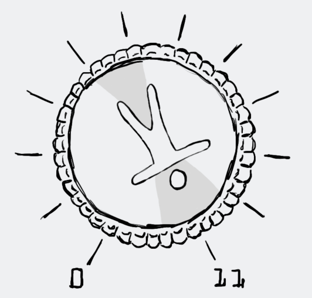

# Accessibility Up to 11

<p align="center">
    
</p>

**Accessibility Up to 11** is my personal blog and website focused on digital accessibility, iOS development, and creating inclusive mobile experiences. The site is built using Swift and the [Ignite](https://github.com/twostraws/Ignite) static site generator framework.

## About This Repository

This repository contains the source code for my personal blog, which covers topics including:

- iOS accessibility development
- Mobile app accessibility best practices
- Digital accessibility advocacy
- Swift programming for inclusive design
- WWDC accessibility sessions and insights
- Accessibility testing and implementation

While this is my personal blog, the repository is public to:
- Allow others to learn from the implementation
- Enable community feedback and issue reporting
- Share accessibility-focused code examples
- Demonstrate Ignite framework usage for personal websites

## Getting Started

To run this site locally:

1. **Clone the repository:**
```bash
git clone https://github.com/yourusername/accessibility-up-to-11.git
cd accessibility-up-to-11
```

2. **Install Ignite CLI:**
```bash
make
make install
```

3. **Build the site:**
```bash
ignite build
```

4. **Preview locally:**
```bash
ignite run --preview
```

## Content and Copyright

All blog posts, articles, and written content in this repository are **copyrighted** and represent my personal views and experiences. While the code is open source, the content itself is protected by copyright.

**Content Usage:**
- ✅ You may reference and link to articles
- ✅ You may quote excerpts with proper attribution
- ❌ You may not reproduce entire articles without permission
- ❌ You may not use content for commercial purposes without permission

**Code Usage:**
- ✅ Feel free to use and modify the Swift code
- ✅ Adapt components and layouts for your own projects
- ✅ Submit issues and pull requests for improvements

## About the Author

This blog is maintained by [Daniel Devesa Derksen-Staats](https://github.com/dadederk) and focuses on making digital experiences more accessible and inclusive. The content reflects personal experiences, learnings, and advocacy in the accessibility space.

## Credits

This website is built using the [Ignite](https://github.com/twostraws/Ignite) static site generator, created by [Paul Hudson](https://twitter.com/twostraws) and the Ignite community. Ignite is available under the MIT license.

Special thanks to:
- The Ignite framework contributors
- The accessibility community for being so inspiring and for your feedback
- Apple's accessibility team for their continued work and improvements

## License

**Code:** MIT License - Feel free to use and modify the Swift code for your own projects.

**Content:** All Rights Reserved - The blog posts, articles, and written content are copyrighted and may not be reproduced without permission.
